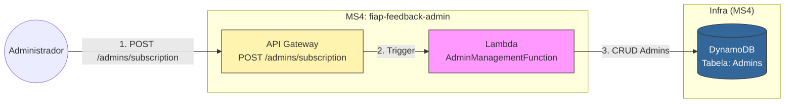

# FIAP Feedback Admin (Microsserviço 4)

Este repositório contém o microsserviço de **Admins** da plataforma de Feedback. Ele é responsável por cadastrar os admins que desejam receber emails referentes aos feedbacks de urgência e aos relatórios.

### Arquitetura da Solução



## 📦 Como Fazer o Deploy

1.  **Compile o projeto:**
```bash
.\mvnw.cmd clean package -DskipTests
```

2.  **Execute o deploy guiado com base no `samconfig.toml` já existente:**
```bash
sam deploy
```
    

3. **Para deletar os serviços criados da AWS**
```bash
sam delete --stack-name fiap-feedback-admin
```
